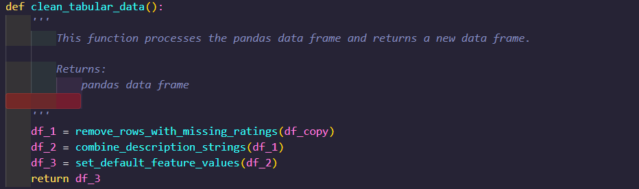
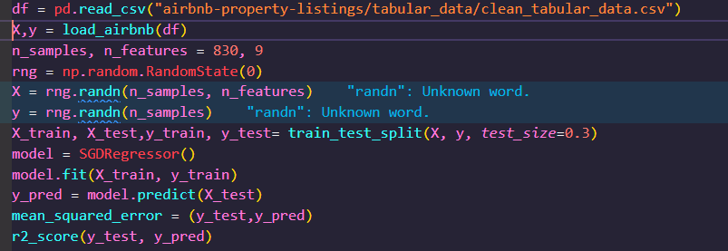

## Modelling Airbnb Property Listing Dataset Project
&nbsp;

The aim of this project is to develop a framework for a wide range of machine learning models that can be applied to various datasets. 

&nbsp;

## Milestone 1 - Data Preparation
&nbsp;

__Tabular Data__ 

The first step is to download and save the images and tabular data folder. The tabular data folder contains the AirBnbData.csv. The tabular data contains the following columns:

* ID: Unique identifier for the listing
* Category: The category of the listing
* Title: The title of the listing
* Description: The description of the listing
* Amenities: The available amenities of the listing
* Location: The location of the listing
* guests: The number of guests that can be accommodated in the listing
* beds: The number of available beds in the listing
* bathrooms: The number of bathrooms in the listing
* Price_Night: The price per night of the listing
* Cleanliness_rate: The cleanliness rating of the listing
* Accuracy_rate: How accurate the description of the listing is, as reported by previous guests
* Location_rate: The rating of the location of the listing
* Check-in_rate: The rating of check-in process given by the host
* Value_rate: The rating of value given by the host
* amenities_count: The number of amenities in the listing
* url: The URL of the listing
* bedrooms: The number of bedrooms in the listing
* Unnamed: 19: empty column
  
<ins>__Pandas__</ins>

&nbsp;Pandas is a fast, powerful, flexible and easy to use open source data analysis and manipulation tool,built on top of the Python programming language. In order to
process the tabular data pandas was installed (pip install pandas). 

The tabular_data.py script contains the functions coded in order to clean and process the tabular data. The  next step is to code __read_csv()__ function which reads in the tabular data csv and converts it to a pandas data frame(df). The __copy()__ function is then called to create a copy of the df. This copy of the original df can now be cleaned and manipulated. 

&nbsp;<ins>__missing ratings__</ins> 
&nbsp;

The __isna().sum()__ function is used to calculate the sum of NaN (missing) values in the pd data frame. Figure 1 belows shows that the sum of the missing values in each column. 

&nbsp;

<kbd><kbd>

Figure 1 - Sum of the missing values in data frame

Missing values in the numerical data will cause issues when trying to train the machine learning models therefore, a function is coded (Figure 2) which passes the df as an argument and creates a new data frame (df1) with the __dropna(subset)__ function called. The ratings columns now contain 0 missing values as shown in Figure 3 below. The function returns the new data frame.

<kbd><kbd>
*Figure 2 - Remove rows with missing ratings function*

<kbd><kbd>
*Figure 3 - Sum of NaN values in the df1*

<ins>__Description strings__</ins>

&nbsp;
The __combine_description_strings__ function (Figure 4) passes the data frame which is returned from the  __remove_rows_with_missing_ratings__ function and processes and cleans the strings within the description column. The function:

* Creates a new data frame(df2) using df1 and calls the __dropna(subset)__ to remove the missing values.
* Calls the __str.replace()__ function to replace the strings 'About this space' and other strings not needed and replaces this with ''.
* Calls the __str.join()__ function to join the strings.
* Calls the __to_list()__ function to combine the list items into the same string.
* returns df2.

&nbsp;

<kbd><kbd>
*Figure 4 - Combine description string_function*

<ins>__Feature values__</ins> 

The __set_default_feature_values__ function (Figure 5) passes the data frame which is returned from the __combine_description_strings__ function 
and calls the __fillna()__ function which replaces the missing values in the "guests", "beds", "bathrooms" and "bedrooms" columns with the value 1. the function returns a new data frame(df3).

&nbsp;

<kbd><kbd>
*Figure 5 - Set default features values function*

&nbsp;

<ins>__clean tabular data__</ins>

The functions mentioned above are wrapped into the __clean_tabular_data__(Figure 6) function hence when called a new df is created with the cleaned tabular data then the __to_csv__ function is called to create a new csv labeled 'clean_tabular_data.csv' from the new df.  

<kbd><kbd>
<kbd>

*Figure 6 - clean tabular data function* 

&nbsp;

<ins>__Format Image Data__</ins>

The prepare prepare_image_data.py script contains the code which processes the image data. The images are saved in a folder which is named as the UUID of the listing which it contains the images for.

&nbsp;

<ins>__downloadDirectoryFroms3 function__</ins> 

&nbsp;

The __downloadDirectoryFroms3__ function (Figure 7) takes the aws S3 bucket name and Remote directory name as an argument  and downloads the images from the 'airbnb-property-listings bucket and saves into to the images folder.

<kbd><kbd>

*Figure 7 - downloadDirectoryFroms3 function*

<ins>__create_directory function__</ins> 

The __create_directory function__ (Figure 8) creates a new directory for the images that will be processed.The function returns the path of the directory.

<kbd><kbd>

*Figure 8 - Create directory function*

&nbsp;

<ins>__calculate_smallest_image_height function__</ins>

&nbsp;The function (Figure 9) takes in the path returned from the __create_directory__ function and for loop is coded which iterates through each image and calculates the images height and appends the height to the image_height list.The smallest image height is calculated using the __min__ function. The function returns the smallest image height.

&nbsp;

<kbd><kbd>

*Figure 9 - calculate_smallest_image_height function*

&nbsp;

<ins>_delete_image_by_mode_</ins>

The function (Figure 9) takes in the  image mode (set to RBG), the file path of the resized image and the image and codes a for loop which check if the image mode of the image is not set to RBG and deletes the image file path if this is the case.

<kbd><kbd>

*Figure 9 - deletes images by mode function*

&nbsp;

<ins>__resize_images function__</ins>

The function takes in the path returned from the __create_directory__ function and codes a for loop which iterates through the images and calls the __calculate_smallest_image_height__ function to return the smallest image height (base_height) then calculates the image aspect ratio (width/height) and resizes the image height based on the ratio of the smallest image height (base_height*aspect_ratio) and saves the image in a directory located in the processed_images folder. This function is called  within the __name__ == "__main__"  block.

<kbd><kbd>

*Figure 10 - resize images function*

&nbsp;

<ins>__get data in the right format__</ins>

In order to process the data into model, the data must be split into features and labels. The features represent the input variables (x) and the label (y) represent the thing that is being predicted. As the models will contain features and a labels,the framework will consist entirely of   supervised learning algorithms.

For the first batch of modelling, the features are the numerical tabular data and the label is the "price_night" feature. Within the tabular_data.py script the __load_airbnb__ function is coded which passes the new df created from the 'clean_tabular_data.csv' and assigns the features a new df which calls the __select_dtypes(include='float64')__ function . The labels df is then created using the new df and extracts the 'Price_Night' column. The features and labels are returned as a tuple.
&nbsp;

<kbd><kbd>

*Figure 10 - load_airbnb function*

&nbsp;

## Milestone 2 - Create a regresion model
&nbsp;

<ins>__simple regression model to predict the nightly cost of each listing__</ins> 

The modelling.py script contains the main code for training the various models. The first step is create a simple regression model to predict the nightly cost  of each listing. the __load_airbnb__ function is imported from the tabular_data.py which contains the df for the  features (numerical data minus nightly cost) and label (nightly cost). This model is trained using the SKlearn __Stochastic Gradient Descent (SGD)Regressor class__. The __test split function__  is used to split the data into training and testing sets. The __randn__ function randomises the data in the features and label dataset.The training set is used to train the model and the test set is used to provide an unbiased evaluation of the final model fit on the training data set. SGD model is imported from Sklearn and the next step to create a variable which calls the __SGDRegresssor__ class. The __fit()__ function is  then called to fit the training data with SGD. Now that the model is fitted,  the __prediction function__ is called to make a prediction of the nightly cost based on the fitted  training data set. The __np.random.seed__ function ensures that the ranpseudo-random numbers generated within NumPy __randint__ function can be stored, hence the model results can be repeated after each run. 

<ins>__Evaluation the regression model performance__<ins>

SKlearn is then used to evaluate the key measures of performance regression. This is done by importing the mean sqaure error and R2 score functions from the Sklearn metrics. The __mean_square_error__ and __r2score__ functions and are then call to calculate the mean square error and the R2 score on the test data set (Figure 11). 

<kbd><kbd>

Figure 11 - SGD model code

&nbsp;

<ins>__Evaluation the regression model performance__<ins>

&nbsp;

<ins>_Tune the hyperparameters of the model using methods from SKLearn_<ins>

&nbsp;

In order to tune the accuracy of the model, the hyperparameters need to be tuned. This is done by implementing SKlearns __GridSearchCV libary__ function. The __GridSearchCV libary__ function helps loop through predefined hyperparameters and fits the model on the training set. The  __tune_regression_model_hyperparameters__ function(Figure 12) passes the model, X,y,X_test,y_test and a dictionary of the hyperparameters to be tuned and calls the __GridSearchCV libary function__ which loops through the dictionary of hyperparameters then the __fit__ function fits the model, then the __predict function__ makes a prediction on the test data set. The __mean_squared_error__ function calculates the mean squared error between the y_test and the predictions. The function returns the the best model, the best model hyperparameters and the performance metrics.

&nbsp;
<kbd><kbd>

*Figure X - tune_regression_model_hyperparameters function*

&nbsp;

<ins>__Cross validation__<ins>

In general ML models the features and labels dataset is split into Training,Test and validation sets, however __GridSearchCV libary__ function a resampling method (cv) that uses different portions of the data to test and train a model on different iterations.In SKlearn the model is trained using k-1 of the folds as training data and then then resulting model is validated on the remaining part of the model (Figure X).
&nbsp;

<kbd><kbd>
Figure X - Cross validation diagram 

&nbsp;

<ins>__Remaining GridSearchCV parameters__<ins>

The remaining paramEters called in the __GridSearchCV libary function__ is the estimator which is the model, n_jobs (set to -1) which means all the processors are being used (this reduces the run time of the tuning process) and the verbose is set to 1 (hence no progress metrics are shown).

&nbsp;

<ins>__hyperparameter selection__<ins>

The first value/boolean statement/option to be tuned for each hyperparameter is chosen based on the defaults provided in the SKlearn manual. Then a range of values were tested by increasing/decreasing from the default value. In general each hyperparameter provided in the SKlearn manual was chosen to be tuned. After a few model runs some hyperparameters were removed to decrease the model run time.

&nbsp;

<ins>__Save the model__<ins>

The function(Figure 12) passes in the model,best_hyperparameters,performance_metrics, and a key work argument folder and saves the best model and its hyperparameters and performance metrics.

&nbsp;

<kbd><kbd>
*Figure 13 - Save model function*

&nbsp;

<ins>__Beat the baseline regression model__<ins>

In order to improve the baseline regression model, it was decided to apply different regression models provided by Sklearn. This includes decision trees, random forests, and gradient boosting. In order to run these addtional models they are first imported from Sklearn. The __evaluate_all_models function__ calls the __tune_regression_model_hyperparameters functions__ for each model scenario sequentially and the __save_model function__ is called to save the best model, hyperparameters and performance metrics.

&nbsp;

<kbd><kbd>
*Figure X - evaluate_all_models function*

&nbsp;

<ins>__find the best overall regression model__<ins>

In order to find the best overall regression model the performance metric(RMSE) needs to be compared against each model. The __find_best_model__ function loads the RMSE for each model and appends to a list, then a for loop is coded to find the lowest RMSE which will decide the best overall regression model and then returns the model, hyperparameters and performance metrics. The gradient boosting  algorithm contained the lowest RMSE hence is the best regression model for price night model scenario.

&nbsp;

<kbd><kbd>
*Figure X - find_best_model function*

&nbsp;
## Milestone 3 - Create a classification model 

&nbsp;

<ins>__simple classification model to predict the category of the airbnb properties__<ins> 

In order run the simple classification model the __load_airbnb function__  is used to generate the features (tabular data) and label ('category').

&nbsp;

<kbd><kbd>

*Figure 15 - Occurrence of each type of ainbnb property* 

&nbsp;

in order to pass the data into the model, the label needs to be encoded to its numerical representation by using label Encoder. This is done by importing the __label Encoder function__
from the Sklearn and calling an instance of the __label Encoder__ function then the __transform function__ to encode the label data. As with the regression model the next step is to split the data into test and train datasets. The parameter __random_state__ with the 
__train_test_split__ function ensures that the data is shuffled before training.
The model is then trained using Sklearn __Logistic regression class__. Now that the model is fitted,  the __prediction function__ is called to make a prediction of the category of the air bnb apartments based on  training data set(Figure 16). 

&nbsp;

<kbd><kbd>

*Figure 16 - Logistic regression model code*

&nbsp;

<ins>__Evaluation of the classification model performance__<ins>

SKlearn is then used to evaluate the key measures of performance of the logistic regression model. This is done by importing the __precision, recall and f1_score functions__ from the Sklearn metrics. The __precision, recall and f1_score__ functions are then called to calculate the precision,recall and f1 score on the test data set (Figure 16). 

&nbsp;

<ins>__Tune the hyperparameters of the model using methods from SKLearn__<ins>

Just like the regression models the hyperparameters for the logistic regression needs to be tuned. The steps follow the same process as mentioned within the Milestone  2 but instead the 
code is wrapped in the __tune_classification_model_hyperparameters functions__(Figure 17).

&nbsp;

<kbd><kbd>
*Figure 17 - tune_classification_model_hyperparameters function*

&nbsp;

<ins>___save the classification model__<ins>_

the __save_model__ function is called and saves the logistic regression model  along with its hyperparameters and performance metrics.

&nbsp;

<ins>__beat the baseline classification model__<ins>

The performance of the baseline model can be improved by using different models provided by SKlearn. This is done by using the classification versions of the decision trees, random forest and gradient boosting model algorithms. The __evaluate_all_models__(Figure 18) calls the __tune_classification_model_hyperparameters__ function for each model sequentially and returns the best model, hyperparameters and performance metrics and the __save_model__ function saves this data accordingly.

&nbsp;

<kbd><kbd>
*Figure 18 - evaluate_all_models function*

<ins>__Find the overall classification model__<ins>

The __find_best_model__ function is adapted to take in a keyword argument called task_folder. This is to ensure the function finds the correct models (i.e regression or classification). 
The precision score was decided as the performance metric to find the best model. The __find_best_model__ function loads the precision score for each model scenario and appends to a list, then a for loop is coded to find the highest precision score and then returns the model, hyperparameters and performance metrics. The random forest model produced the highest precision score and was the best classification model for airbnb property category  scenario.

<kbd><kbd>
Figure 19 - find_best_model function

&nbsp;

## Milestone 4 - Create a configurable neural network

<ins>__define first neural network model__<ins>

A neural network is a method in artificial intelligence that teaches computers to process data in a way that is inspired by the human brain. It is a type of machine learning process, called deep learning, that uses interconnected nodes or neurons in a layered structure that resembles the human brain. 
&nbsp;

The neural network will be constructed using PyTorch which is An open source machine learning framework that accelerates the path from research prototyping to production deployment. The neural network will be modelled to predict the nightly cost of each listing. 
&nbsp;

<ins>_class AirbnbNightlyPriceDataset_<ins>

In order run a neural network with PyTorch, the  model data needs be processed in the correct data format and represented as  pytorch tensors. 
Pytorch provides a way to create data via the torch.utils.data module. it allows us to:

* Create custom datasets
* Quickly load data in batches using multiple processes  space 
* Pin data to GPU memory for faster transfers
  
The __class AirbnbNightlyPriceDataset__ is a map style-data set which inherits from the torch.utils.data Dataset. The methods within the class are detailed below.

<ins>__init method__<ins>

The __init method__ calls the __super().__init__() method__ which delegates the function call to the parent class, which is nn.Module. This is needed to initialise the nn.Module properly. The __load_airbnb__ function is called which loads the features(numerical data) and label(price_night) then to __numpy method__ is called to convert the features and label into numpy arrays.

__getitem method__

The method loads and returns a sample from the dataset at the given index (idx).

__len method__

The method returns the number of samples in the dataset.

&nbsp;

<kbd><kbd>
*Figure 20 - class AirbnbNightlyPriceImageDataset*

&nbsp;

<ins>__Dataloader__<ins>

Dataloader batches the data so that it can be easily consumed by neural network. The data loader(Figure 21) is represented as a dictionary and the __torch.utils.data.random_split()__ function is called to split the data into train,test and validation data sets and this is assigned in the dataloader. The arguments defined in the data_loader are detailed below: 

* Batch_size - sets the size of the batches.
* Shuffle = True - Ensures that data is shuffled before each iteration.
* Pin in_memory=torch.cuda.is_available() - sets where tensors should be loaded in pinned memory regions which may improve tensor transfor to GPU.
* num_of_workers = 8 - specifies how many processes in parallel will be used to load data. number  of workers is set by dividing the output of calling the  __multiprocessing.cpu_count function__ by 2.

&nbsp;

<kbd><kbd>
*Figure 21 - Dataloader*

&nbsp;

<ins>__Define the first neural network model__<ins>

<ins>_class NeuralNetwork_<ins>

The neural network is defined by subclassing the nn.Module, and initialising the neural network layers in the __init__ methpd. The input and output layers are defined by calling the __torch.nn.Linear()__ method. The __nn.ReLU()__ method is placed in between the input and the output layer. The ReLU is is an activation function that introduces the property of non-linearity to a deep learning model and solves the vanishing gradients issue. The ReLU method replaces all the negative values with 0 and all the non-negative left unchanged. These layers are placed within __torch.nn.Sequential class__ which is a sequential container which can run the layers sequentially. The __forward__ method will pass the data into the computation graph (neural network). This will represent our feed-forward algorithm.

Figure 21 - class neural network

<ins>_Create the training loop and train the model to completion_<ins>

<ins>_train function_<ins>

The __train__ function passes the model and the epoch for each iteration and a for loop is coded which splits the features and labels in each  training batch then calls the __to.torch()__ method to convert to the datatype from float 64 into float 32. A prediction is then made by passing the features into the __forward__ method in the neural network class and the loses is calculated and optimised as detailed in the paragraph below. The model is then trained for the number of epochs(Figure 22). The __summary writter function__ method is called in the train loop in order to create a graphical representation of optmised loss function. The loops then loads the data in the validation data set and repeats the process of the training dataset.

&nbsp;

<ins>__loss function__<ins>

The loss function within the training loop is calculated between the prediction and label using the __F.mse_loss__ function. The __optimiser.zero_grad()__ function is called before the loss function, because the __optimiser.zero_grad()__ function sets the gradients to zero during each batch loop before initiating backpropragation. This ensures that losses decrease during each batch run. The __backward()__ function is called after the loss function which computes backward propagation(calculates the gradients) and the __optimiser.step()__ function is then called which updates the weights within the gradients.

<kbd><kbd>
*Figure 22 -  Train function*

<ins>__Visualise the metrics__<ins>

&nbsp;The __writer.add_scalar__ function saves the loss data and outputs into graphical format in tensor board as shown in Figure X below.

Figure 23 -  Train graph metrics

Figure 24 -  validation graph metrics

&nbsp;

<ins>_Create a configuration file to change the characteristics of the model_<ins>

nn_config.yaml file was created which contains a dictionary of the architecture of the neural network model. This includes:

* The name of the optimiser(SGD) 
* The learning rate(lr)
* The width of the hidden layer
* The depth of the model

Within the modelling.py script the __get_nn_config()__ function takes in the yaml as an argument and returns it as a dictionary. 

<ins>__hidden layer and model depth__<ins>

In order to set these parameters  into the model, the configuration file is passed into the model class upon initialisation. The order of the layers in the neural network should be the input layer then ReLU activation function then the hidden layer(ReLU set in between each hidden layer) then the output layer. In order to pass this configuration into the __nn.sequential__  method the __OrderedDict function__ is assigned to store these layers in the correct order and a for loop is coded to generate the hidden layers based on the width of the hidden layer and depth of the model(loaded from the config file) and the subsequent ReLU  layers . The ordered dict is then passed as an argument in the __nn.sequential__ method.

<kbd><kbd>
*Figure 22 -  Neural Network configuration*

&nbsp;

<ins>__Optimiser parameters__<ins>

The configuration file is passed into the __train__ function and the __torch.optim.SGD__ method  is called to load in the optimiser parameters (lr).

<kbd><kbd>
*Figure 25 -  method of creating model layers for neural network*

&nbsp;

<ins>__save the model__<ins>

The __save_model__ function was adapted to take a key word argument module as such that if module = 'Pytorch' the function will detect the Pytorch model and save the model along with the hyperparameters and best parameters accordingly.

&nbsp;

<ins>__train function__<ins>

In order to obtain a full suite of performance metric for the model, the following functionality was added to the __train__ function:

* RMSE loss -  calculated by calling the __torch.sqrt() function__ on the mse.
* R*2 score - calculated  by calling an instance  of the __R2Score()__ class.
* Recording The time taken to train the model.
* Recroding The average time taken to make a prediction.

THe train function returns the model, hyperparameters and performance metrics and calls the __save_model__ function.

*Figure 25 -  train function*

&nbsp;

<ins>__Tune the model__<ins>

In order to increase the performance of the model it needs to be run with a range of optimisers with varying parameters. This is done by creating a list of dictionaries within the configuration the yaml file. The optimisers used are:
* AADELTA
* SGD
* ADAM
* ADAGRAD

For each of the  optimisers 4 different configurations of the parameters are created which totals into 16 models to be trained. As with the regression and classification model the initial parameters for each optimiser is set based on the default values shown in the Pytorch documentation and are increased/decreased accordingly. 

The __find_best_nn__ function calls the __get_nn_config__ and a for loop is coded which passes each configuration as a dictionary into __train__ function and trains the model based on the optimiser configuration.

&nbsp;

## Milestone 5 - Reuse the framework for another use-case with the Airbnb data
&nbsp;

<ins>_Reusing the framework_<ins>

The __load_dataset function__  is used to get a new Airbnb  dataset where the label is the integer number of bedrooms. The previous label(price_night) is added to the features.
&nbsp;

The model pipeline is then rerun (regression and neural network models). The __find_best_model__ function is then used to load the performance metrics to find the best regression and neural network model for the new used case.

in order to fully automate the docker image build and container run, it was first required to set up Github actions on the repository

__Create repository__
&nbsp;

__Refactoring__

The first step was to review and refractor the code written in milestone 2. This included;

* Renaming methods and variables so that they are clear and concise to any who reads the script.
* Ensuring that the appropriate methods were made private.
* Re-ordering the sequence of the imports required for the code to run in alphabetical order.
* Adding docstrings to methods.

 These improvements makes the code look clearer and more user friendly.