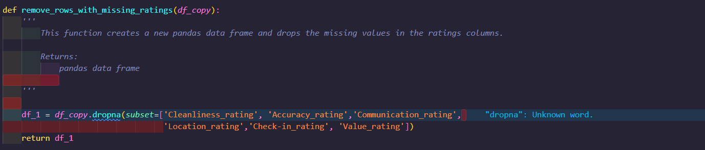
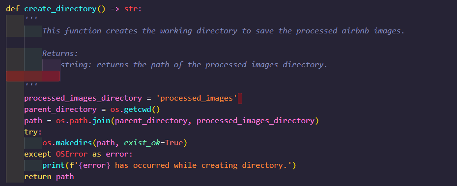
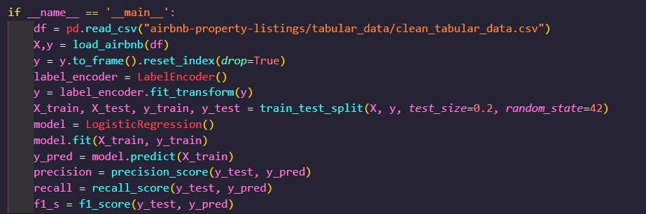

## Modelling Airbnb Property Listing Dataset Project
&nbsp;

The aim of this project is to develop a framework for a wide range of machine learning models that can be applied to various datasets. 

&nbsp;

## Milestone 1 - Data Preparation
&nbsp;

__Tabular Data__ 

The first step is to download and save the images and tabular data folder. The tabular data folder contains the AirBnbData.csv. The tabular data contains the following columns:

* ID: Unique identifier for the listing
* Category: The category of the listing
* Title: The title of the listing
* Description: The description of the listing
* Amenities: The available amenities of the listing
* Location: The location of the listing
* guests: The number of guests that can be accommodated in the listing
* beds: The number of available beds in the listing
* bathrooms: The number of bathrooms in the listing
* Price_Night: The price per night of the listing
* Cleanliness_rate: The cleanliness rating of the listing
* Accuracy_rate: How accurate the description of the listing is, as reported by previous guests
* Location_rate: The rating of the location of the listing
* Check-in_rate: The rating of check-in process given by the host
* Value_rate: The rating of value given by the host
* amenities_count: The number of amenities in the listing
* url: The URL of the listing
* bedrooms: The number of bedrooms in the listing
* Unnamed: 19: empty column
  
<u>__Pandas__</u>

&nbsp;Pandas is a fast, powerful, flexible and easy to use open source data analysis and manipulation tool,built on top of the Python programming language. In order to
process the tabular data pandas was installed (pip install pandas). 

The tabular_data.py script contains the functions coded in order to clean and process the tabular data. The  next step is to code __read_csv()__ function which reads in the tabular data csv and converts it to a pandas data frame(df). The __copy()__ function is then called to create a copy of the df. This copy of the original df can now be cleaned and manipulated. 

<u>__missing ratings__</u> 
&nbsp;

The __isna().sum()__ function is used to calculate the sum of NaN values in the pd data frame. Figure 1 belows shows that the rating columns contained missing values. 

||

*Figure 1 - Sum of NaN values in the pd data frame*

This would cause problems when trying to train the machine learning models therefore, a function was coded (figure 2) which passes the df as an argument and creates a new data frame (df1) with the __dropna(subset)__. The ratings columns now contain 0 missing values as shown in Figure 3 below. The function returns the new data frame.

*Figure 2 - Remove rows with missing ratings function

*Figure 3 - Sum of NaN values in the pd data frame

_Description strings_ 
&nbsp;

The __combine_description_strings__ function (figure 4) is coded which passes the data frame which is returned from the  __remove_rows_with_missing_ratings__ function and processes and cleans the strings within the description column. The process includes the:

* Creates a new data frame(df2) using df1 and calls the __dropna(subset)__ to remove the NaN values in the description column. 
* Calling the __str.replace()__ function to replace the strings 'About this space' and other strings not needed and replace this with ''.
* Calling the __str.join()__ function to join the strings in the description column.
* Calling the __to_list()__ function to combine the list items into the same string.
* returns df2

&nbsp;

*Figure 4 - Combine description string_function

_Feature values_ 

The __set_default_feature_values(__ function (figure 5) is coded which passes the data frame which is returned from the __combine_description_strings__ function and creates a new df (df3)
using df2 and calls the __fillna(1)__ function which replaces the NaN values in the "guests", "beds", "bathrooms" and "bedrooms" columns with the value 1. the function returns the data frame(df3).

&nbsp;

*Figure 5 - Set default features values function 

_clean tabular data_ 

The functions mentioned above are wrapped into the __clean_tabular_data__(figure 6) hence when called a new df is created with the cleaned tabular data then the __to_csv__ function is called to create a new csv labeled as 'clean_tabular_data.csv' from the new df.  

*Figure 6 - clean tabular data function 

&nbsp;

__Format Image Data__ 

The prepare prepare_image_data.py script contains the code which processes the image data. The images are saved in a folder which is named as the UUID of the listing which it contains the images for.

_downloadDirectoryFroms3 function_ 

The __downloadDirectoryFroms3__ (Figure 7) takes the aws S3 bucket name and Remote directory name as an argument  and downloads the images from the 'airbnb-property-listings' and saves into to the images folder.

*Figure 7 - downloadDirectoryFroms3 function

_create_directory function_ 

The __create_directory function__ (Figure 8) creates a new directory for the images that will be processed.The function returns the path of the directory.

*Figure 8 - Create directory function

_calculate_smallest_image_height function_

The __calculate_smallest_image_height function__ takes in the path returned from the __create_directory function__ and for loop is coded which iterates through each image and calculates the images height and appends the height to the image_height list.The smallest image height is calculated using the __min__ function. The function returns the smallest image height.

_delete_image_by_mode_

The __delete_image_by_mode__ function (Figure 9) takes in the  image mode (set to RBG), the file path of the resized image and the image and codes a for loop which check if the image mode of the image is not set to RBG and deletes the image file path if this is the case.

*Figure 9 - deletes images by mode function

_resize_images_

The __resize_images function__ takes in the path returned from the __create_directory function__ and codes a for loop which iterates through the images and  calls the __calculate_smallest_image_height function__ to return the smallest image height (base_height) then calculates the image aspect ratio (width/height) and resizes the image height based a ratio of the smallest image height (base_height*aspect_ratio) and saves the image in a directory located in the processed_images folder. This function is called  within the __name__ == "__main__"  block

Figure 10 - resize images function

&nbsp;

_get data in the right format_

For the first batch of modelling the features are the numerical tabular data and the label is the "price_night" feature. Within the tabular_data.py script the __load_airbnb function__ is coded which takes in the the new df created from the 'clean_tabular_data.csv' and assigns the features a new df which calls the select_dtypes(include='float64') hence the  features df contains the float numerical data. The labels df is then created using the new df and extracts the 'Price_Night' column. The features and labels are returned as a tuple.
&nbsp;

## Milestone 2 - Create a regresion model
&nbsp;

_simple regression model to predict the nightly cost of each listing_ 

The modelling.py script was created an contains the main code  for the various models. The first step is create a simple regression model to predict the nightly cost  of each listing. the __load_airbnb function_ is imported from the tabular_data.py which contains the df for the  features (numerical data - nightly cost) and label (nightly cost). This model is trained using the SKlearn __Stochastic Gradient Descent (SGD)Regressor class__. The __test split function__  is used to split the data into training and testing sets. The training set is used to train the model and the test set is used to provide an unbiased evaluation of a final model fit on the training data set. SGD model is imported from Sklearn and The next step to create a variable which calls the __SGDRegresssor__ class. The __fit()__ function is  then called to fit the training data with SGD. Now that the model is fitted,  the __prediction function__ is called to make a prediction of the nightly cost based on the fitted  training data set. The __np.random.seed function__ ensures(look it up in videos again)(FIGURE 11)

_Evaluation the regression model performance_

SKlearn is then used to evaluate the key measures of performance regression. This is done by importing the mean sqaure error and R2 score functions from the Sklearn metrics. The __mean_square_error__ and __r2score__ functions are then called to calculate the mean square error and the R2 score on the trained data set (Figure 11). 

Figure 11 - SGD model code

_Evaluation the regression model performance_
&nbsp;

_Tune the hyperparameters of the model using methods from SKLearn_

In order to tune the accuracy of the model, the hyperparameters need to be tuned. This is done by implementing sklearns __GridSearchCV libary function__. The __GridSearchCV libary function__ helps loop through predefined hyperparameters and fits the model on the training set. The  __tune_regression_model_hyperparameters functions__(Figure 12) passes the model, X,y,X_test,y_test and a dictionary of the hyperparameters to be tuned and calls the __GridSearchCV libary function__ which loops through the dictionary of hyperparameters then the __fit function__ fits the model, then the __predict function__ makes a prediction on the test data set. The __mean_squared_error function__ calculates the mean squared error bestween the y_test and the predictions. The function returns the the best model, the best model hyperparameters and the hyperparameters.

Figure 12 - Cross validation diagram

&nbsp;

_Cross validation_
In general ML models the features dataset would be split into Training,Test and validation sets, however __GridSearchCV libary function__ contains a parameter called cv which stands for cross validation which  is a resampling method that uses different portions of the data to test and train a model on different iterations.In SKlearn the model is trained using k-1 of the folds as training data and then then resulting model is validated on the remaining part of the model(Figure 12).
&nbsp;

&nbsp;

Figure 13 - Cross validation diagram

_Remaining GridSearchCV parameters_

The remaining paramters called in the __GridSearchCV libary function__ is the estimator which is the model, n_jobs which is set to -1 which means all proccessors are being used (this reduces the run time of the tuning proccess) and the verbose is set to 1 (hence no progress metrics are shown)

&nbsp;
&nbsp;

_hyperparameter selection_

In general The first value/boolean statement/option to be tuned for each hyperparameter was chosen based on the defaults provided in the SKlearn manual. Then a range of values were tested by increasing/decreasing from the default value. In general each hyperparameter provided in the SKlearn manual was chosen to be tuned. After a few model runs the some hyperparameters were removed due to time constraints.

&nbsp;
&nbsp;

_Save the model_

The __save_model function__(Figure 14) takes in the model,best_parameters,performance_metrics, and a key work argument folder and saves the best model and its hyperparameters and performance metrics.

&nbsp;

Figure 13 - Save model function

_Beat the baseline regression model_

In order to improve the baseline regression model, it was decided to apply different regression models provided by Sklearn. This includes decision trees, random forests, and gradient boosting. In order to run these addtional models they are first imported from Sklearn. The __evaluate_all_models function__ calls the __tune_regression_model_hyperparameters functions__ for each model scenario sequentially and the __save_model function__ is called to save the best model, hyperparameters and performance metrics.

&nbsp;

__find the best overall regression model__

In order to find the best overall regression model the performance metric(RMSE) needs to be compared against each model scenario. The __find_best_model function__ loads the RMSE for each model scenario and appends to a list, then a for loop is coded to find the lowest RMSE which will decide the best overall regression model and then returns the model, hyperparameters and performance metrics. The gradient boosting  algorithm contained the lowest RMSE and was the best regression model for price night model scenario.

## Milestone 3 - Create a classification model 

&nbsp;

_simple classification model to predict the category of the airbnb properties_ 

In order run the simple classification model the __load_airbnb function__  is used to generate the features (tabular data) and label ('category').

Figure 15 - Occurance of each type of ainbnb property 

in order to pass the data into the model, the label needs to be encoded to its numerical representation by using label Encoder. This is done by importing the __label Encoder function__
from the Sklearn and calling the an instance of the __label Encoder function__ then the __transform function__ to encode the label data. As with the regression model the next step is then to split the data into test and train datasets. The model is then trained using Sklearn __Logistic regression class__. Now that the model is fitted,  the __prediction function__ is called to make a prediction of the category of the air bnb apartments based on  training data set(Figure 16). The __np.random.seed function__ ensures(look it up in videos again)(FIGURE 11)

Figure 16 - Logistic regression model code

_Evaluation the regression model performance_

SKlearn is then used to evaluate the key measures of performance of the logistic reg. This is done by importing the __precision, recall and f1_score functions__ from the Sklearn metrics. The __precision, recall and f1_score functions__ functions are then called to calculate the mean square error and the R2 score on the test data set (Figure 16. 

&nbsp;

_Tune the hyperparameters of the model using methods from SKLearn_

Just like the regression models the hyperparameters for the logistic regression needs to be tuned. The steps follow the same process as mentioned within the Milestone but instead the 
code is wrapped in the __tune_classification_model_hyperparameters functions__(Figure 17).

&nbsp;

Figure 17 - __tune_classification_model_hyperparameters()__ function

__save the classification model__

Similar to the regression model in milstone 2 the logistic regression model is saved along with its hyperparameters and performance metrics.

__beat the baseline classifcation model__

&nbsp;

Similar to the regression model in milstone 2 the performance of the baseline model can be improved by using different models provided by SKlearn. This is done by using the classification version of the decision trees, random forest and gradient boosting algorithms. The __evaluate_all_models__(Figure 18) calls the __tune_classification_model_hyperparameters functions__ for each scenario sequentially and returns the best model, hyperparameters and performance metrics and the _Save_model function__ saves this data accordingly.

Figure 18 - __evaluate_all_models__ function

_Find the overall classification model_

The __find_best_model function__ is adapted to take in a keyword argument called task_folder. This is to ensure the function finds the correct models (i.e regression or classification). 
The precision score was decided as the performance metric to find the best model. The __find_best_model function__ loads the precision for each model scenario and appends to a list, then a for loop is coded to find the highest precision score and then returns the model, hyperparameters and performance metrics. The decision tree  algorithm contained produced the highest precision score and was the best regression model for airbnb property category  scenario.

Figure 19 - _Find_best_model_function_

## Milestone 4 - Create a configurable neural network

__define first neural network model__

_ class AirbnbNightlyPriceDataset_

In order run a neural network with pytorch, the  model data needs be in the correct format which are pytorch tensors. 
Pytorch provides a way to create data via torch.utils.data module. it allows us to:

* Create custom datasets
* Quickly load data in batches using multiple processes  space' and other strings not needed and replace this with ''.
* Pin data to GPU memory for faster transfers
  
The __class AirbnbNightlyPriceDataset__ is a map style-data set which inherits from the torch.utils.data Dataset. The methods within the class are detailed below.

__init method__

The __init method__ calls the __super().__init__() method__ which delegates the function call to the parent class, which is nn.Module. This is needed to initialise the nn.Module properly. The __load_airbnb(df)__ function is called which loads the features(tabular data) and label(price_night) to __numpy method__ is called to convert the features and label into numpy arrays

__getitem method__

This method function loads and returns a sample from the dataset at the given index (idx)

__len method__

The method returns the number of samples in our dataset.

&nbsp;

Figure 20 - class AirbnbNightlyPriceImageDataset

_Dataloader_

Dataloader batchaes the data so that it can be easily consumed by neural network. The data loader(Figure 21) is represented as a dictionary and the torch.utils.data.__random_split()__ is called to split the data into train,test and validation data sets and this is assigned in the dataloader. The arguments defined in the data_loader are detailed below: 

* Batch_size- sets the size of the batches 
* Shuffle = True - Ensures that data is shuffled before each iteration
* Pin in_memory=torch.cuda.is_available() - sets where tensors should be loaded in pinned memory regions which may improve tensore transfor to GPU.
* num_of_workers = 8 - specifies how many processes in paralel will be used to load data. number  of workers is set by diving the output of calling the  __multiprocessing.cpu_count function__ by 2.

&nbsp;

Figure 21 - Dataloader

_Define the first neural network model_

_class NeuralNetwork_

The neural network is defined by by subclassing the nn.Module, and initialising the neural network layers in __init__. The input and output layers are defined by calling the __torch.nn.Linear()__ method. The __nn.ReLU()__ layer is placed inbetween the input and the output layer. The ReLU IS is an activation function that introduces the property of non-linearity to a deep learning model and solves the vanishing gradients issue. The ReLU method replaces all the negative values with 0 and all the non-negative left unchanged. These layers are placed within __torch.nn.Sequential class__ which is a sequential container which can run the layers sequentially. The __forward method__ will pass the data into the computation graph (ur neural network). This will represent our feed-forward algorithm.

Figure 21 - class neural network

_Create the training loop and train the model to completion_

__train function__

The __train function__ passes the model and the epoch for each iteration and a for loop is coded which splits the features and labels in each  training batch then calls the __to.torch()__ method to convert to the datatype from float 64 into float 32. A prediction is then made by passing the features into the __forward method__ in the neural network class and the loses is calculated and optimised as detailed in the paragraph below. The model is then trained for the number of epochs(Figure 22). The __summary writter function__ method is called in the train loop in order to create a graphical representation of optmised loss function. The loops then loads the data in the validation data set and repeats the process of the training dataset.

__loss function__

The loss function within the training loop is then calculated between the prediction and label using the __F.mse_loss function__. The __optimiser.zero_grad() function__ is called before the loss function, since the __optimiser.zero_grad() function__ sets the gradients to zero during each batch loop before starting to do backpropragation this ensures that losses decrease during each batch. The __backward() function__ is called after the loss function which computes backward propagation(calculates the gradients) and the __optimiser.step() function__ is then called which updates the weights.

Figure 22 -  Train function

_Visualise the metrics_
&nbsp;
As mentioned above the __writer.add_scalar function__ saves the loss data and outputs into graphical format in tensor board as shown in Figure below.

Figure 23 -  Train graph metrics

Figure 24 -  validation graph metrics

&nbsp;

_Create a configuration file to change the characteristics of the model_

&nbsp;

nn_config.yaml file was created which contains a dictionary of the architecture of the neural network model. This includes:

* The name of the optimiser(SGD) 
* The learning rate(lr)
* The width of the hidden layer
* The depth of the model

Within the modelling.py script the __get_nn_config() function__ which takes the yaml as an argument and returns it a dictionary. 

_hidden layer and model depth_
In order to set these parameters into the model, the configuration file is passed into the model class upon initialisation. The order of the layers in the neural network should be the input layer then ReLU activation function then the hidden layer(ReLU set inbetween each hidden layer) then the output layer. In order to pass this configuration file into the nn.sequential the __OrderedDict function__ is assigned to store these layers in the correct order and a for loop is coded to generate the hidden layers and ReLU layers based on the width of the hidden layer and depth of the model(loaded from the config file). The ordered dict is then passed as an argument in the __nn.sequential class__

_Optimiser parameters
The configuration file is passed into the __train model function__ w the __torch.optim.SGD class__ is called to load in the optimiser parameters (lr).

Figure 25 -  method of creating model layers for neural network

_save the model_

__train function__

In order to obtain a full suite of performance metric for the model, the following added to the __train function__:

* RMSE loss is calculated for the training and validation prediction by calling the __torch.sqrt() function__ on the mse
* R*2 score is calculated for the training and validation prediction by calling the intiatie a instance of the __R2Score() class_
* The time taken to train the model under a key called
* The average time taken to make a prediction under a key called

THe train function returns the model, hyperparameters and performance metrics.

The _save_model_ function was adapted to take a key word argument module as such that if module = 'Pytorch' the function will detect the model and save it the model alng with the hyperparameters and best parameters accordingly.

_Tune the model_

In order to the model needs to be run with a range of optimisers with a range of parameters. This is done by creating a list of dictionaries with the yaml file. The optimisers used are ADADELTA,SGD,ADAM and ADAGRAD. For each optimiser 4 different configurations are created which totals into 16 models to be trained. As with the regression and classification model the inital parameters for each optimiser is set based on the default values shown in the Pytorch documentation and are increased/decreased accoordingly. 

The __find_best_nn__ calls the __get_nn_config__ and a for loop is coded which passes each configuration into  __train_model function__  and trains the model based on the optmiser configuration.

## Milestone 5 - Reuse the framework for another use-case with the Airbnb data
&nbsp;

_Reusing the framework_

The __load_dataset function__  is used to get a new Airbnb  dataset where the label is the integer number of bedrooms. The previous lable(price_night) is added to the features.
&nbsp;

The model pipeline is then rerun (regression and neural network model). The __find_best__ model is then used to load the performance metrics to find the best regression and neural network model for the new used case.

in order to fully automate the docker image build and container run, it was first required to set up Github actions on the repository

__Create repository__
&nbsp;

__Refactoring__

The first step was to review and refractor the code written in milestone 2. This included;

* Renaming methods and variables so that they are clear and concise to any who reads the script.
* Ensuring that the appropriate methods were made private.
* Re-ordering the sequence of the imports required for the code to run in alphabetical order.
* Adding docstrings to methods.

 These improvements makes the code look clearer and more user friendly.